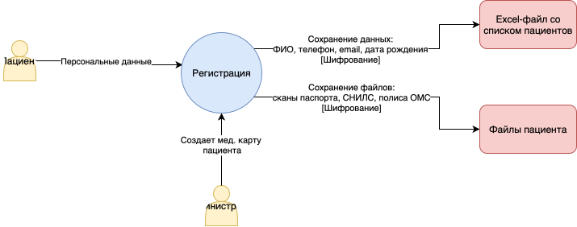
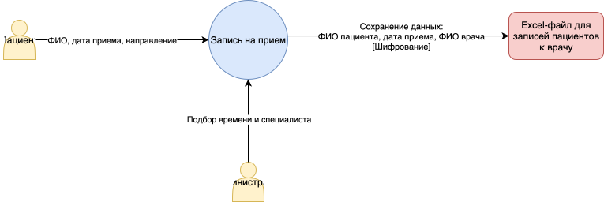
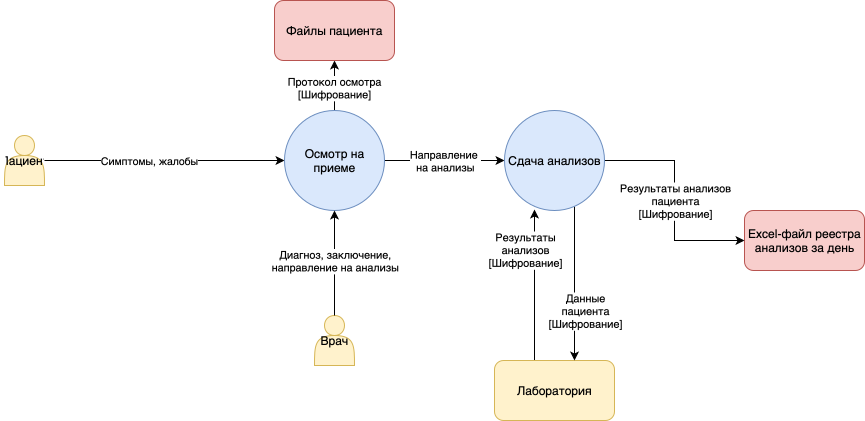
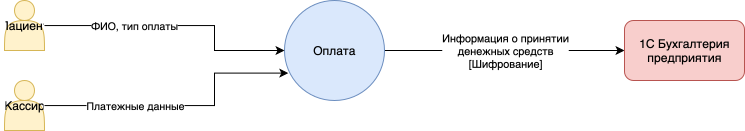
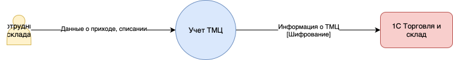
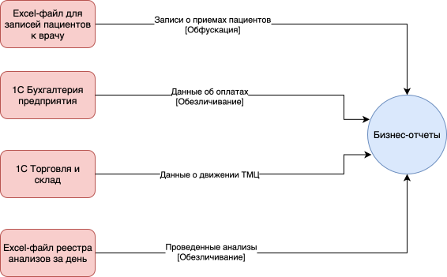

# Анализ безопасности систем

## Задание 1

### Анализ информации о компании

В компании конфиденциальные данные делятся на следующие категории:

1. Персональные данные: ФИО, дата рождения, email-адрес, номер телефона, адрес регистрации, место работы / учебы;
2. Медицинские данные (о состоянии здоровья): диагнозы, анализы, хронические заболевания;
3. Финансовые данные: чеки, закупки, платежные транзакции;
4. Внутренние данные: политики безопасности, аутентификационные данные, секретные документы.

### Потоки данных

1. Регистрация пациента

2. Запись пациента на прием

3. Прием пациента

4. Оплата медицинских услуг

5. Управление складом

6. Аналитика

## Задание 2

| Процесс | Требования     | Соответствие  |
| ------- | -------------- | ------------- |
| Хранение персональных данных пациентов | 1. Шифрование данных;   2. Ограниченный доступ к данным. | 1. Нет;   2. Нет. |
| Обмен данными с лабораторией | 1. Защита канала передачи;   2. Минимальный набор необходимых данных. | 1. Нет;   2. Нет. |
| Проведение платежей | 1. Шифрование данных;   2. Ограниченный доступ к данным. | 1. Нет;   2. Нет. |
| Передача данных в 1С | 1. Защита канала передачи;   2. Контроль целостности данных. | 1. Нет;   2. Нет. |

### Проблемные зоны

1. Отсутствие классификации конфиденциальных данных;
2. Хранение конфиденциальных данных в незашифрованном неструктурированном виде в файлах;
3. Отсутствие разграничения доступа к данным (RBAC/ABAC);
4. Отсутствие аудита доступа к данным, не отслеживаются изменения данных;
5. Отсутствие отслеживания аномалий, нетипичных действий пользователей;
6. Данные аналитики не проходят обработку, используются в исходном виде без анонимизации;
7. Несоблюдение принципов Data Lineage и Data Minimization;
8. Неконтролируемый объем передачи персональных данных в лаборатории;
9. Незащищенный канал взаимодействия между системами.

## Задание 3

### Список данных для защиты

| Тип данных | Способы защиты |
| ---------- | -------------- |
| Персональные данные | Шифрование, маскирование, скремблирование |
| Медицинские данные | Шифрование, обезличивание |
| Финансовые данные | Шифрование, токенизация |
| Вспомогательные данные аналитики (например, активность пользователей) | Обезличивание |

### Тегирование данных

Теги категорий данных:

- PII - персональные данные;
- PHI - медицинские данные;
- FINANCE - финансовые данные;
- SECURITY - политики безопасности, аутентификационные данные.

В качестве инструмента тегирования можно использовать, например, платформу BigID, так как она автоматически помечает таблицы, содержащие персональную информацию (тег PII) и медицинские данные (тег PHI), и поддерживает интеграцию через API с существующими системами.

### Инструменты, способы и меры защиты

1. Шифрование при хранении:
    - Алгоритм AES-256;
    - Vault для управления ключами шифрования, хранения секретов.

2. Шифрование при передаче:
    - TLS 1.3 для взаимодействия систем;
    - VPN для сотрудников.

3. Разграничение доступа к данным:
    - RBAC и ABAC.

4. Анонимизация
    - Обфускация (токенизация, скремблирование);
    - Маскировка (статическая, динамическая).

5. Отслеживание данных, мониторинг доступа к ним, поиск аномалий:
    - SIEM, ELK stack, Jaeger

6. Соблюдение принципа Zero Trust Architecture при разработке систем.
