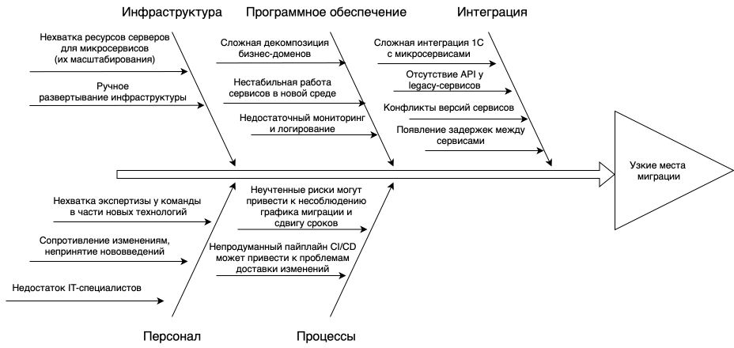

# Оценка узких мест при миграции

## Анализ ситуации

Текущая система:
- Монолитная архитектура;
- Хранение данных в общей папке;
- Преимущественно ручная обработка данных.

Цели миграции:
- Перевод на микросервисную архитектуру;
- Соблюдение законодательства 152-ФЗ, 323-ФЗ;
- Автоматизация ручных операций.

Ключевые процессык и компоненты, затрагиваемые миграцией:
- Базы данных: перенос данных из файлов Excel в СУБД;
- Коммуникационные каналы: реализация API, message queue;
- Серверное оборудование: контейнеризация Kubernetes, возможный перевод на гибридное облако;
- Бизнес-логика: реализация Domain Driven Design, разделение на бизнес-домены.

## Диаграмма Исикавы

## Возможные проблемы

- Инфраструктура:
    - Нехватка ресурсов серверов для микросервисов (их масштабирования);
    - Ручное развертывание инфраструктуры.
- Программное обеспечение:
    - Сложная декомпозиция бизнес-доменов;
    - Нестабильная работа сервисов в новой среде;
    - Недостаточный мониторинг и логирование.
- Интеграция
    - Сложная интеграция 1C с микросервисами;
    - Отсутствие API у legacy-сервисов;
    - Конфликты версий сервисов;
    - Появление задержек между сервисами.
- Персонал
    - Нехватка экспертизы у команды в части новых технологий;
    - Сопротивление изменениям, непринятие нововведений;
    - Недостаток разработчиков.
- Процессы
    - Неучтенные риски могут привести к несоблюдению графика миграции и сдвигу сроков;
    - Непродуманный пайплайн CI/CD может привести к проблемам доставки изменений.

## Рекомендации по устранению проблем

| Рекомендация | Приоритет |
| ------------ | --------- |
| Переход на гибридное облако с автомасштабированием, использование Kubernetes | Высокий |
| Разработка адаптера для 1C | Средний |
| Сделать переход на микросервисы более контролируемым с помощью подхода Parallel Run | Высокий |
| Внедрение мониторинга и логирования с помощью Prometheus, Grafana, ELK stack | Высокий |
| Формализация и документирование процессов | Высокий |
| Внедрение продуманного CI/CD, включающего автотестирование | Высокий |
| Внедрение очереди сообщений (RabbitMQ, Kafka) | Средний |
| Обучение команды новым необходимым технологиям для подготовки к миграции | Высокий |
| Найм IT-специалистов | Средний |
